## Microservices for beginners. Front-end service. Vue js. Socket.io.

Full code of example - [link](https://github.com/Igorok/micro-front)

### Functional requirements for my front-end service:

1) Provide registration

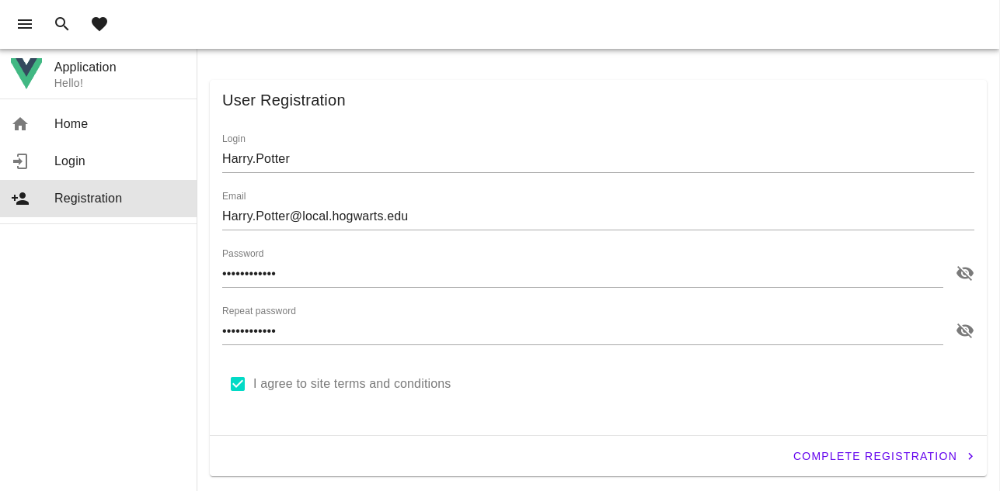

2) Provide login

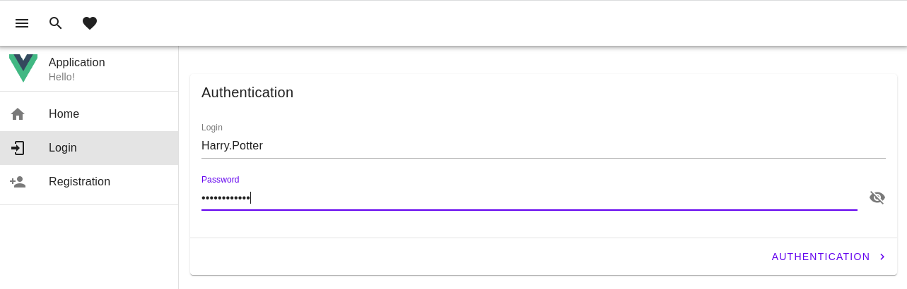

3) Provide list of users

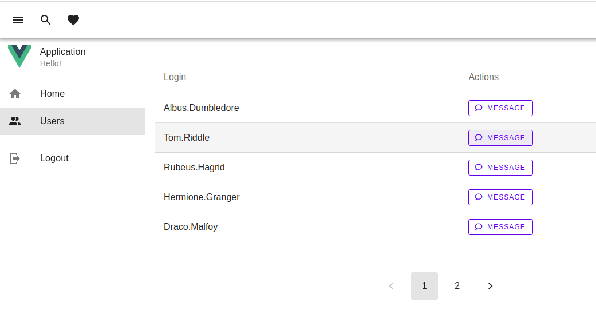

4) Provide conversation between users

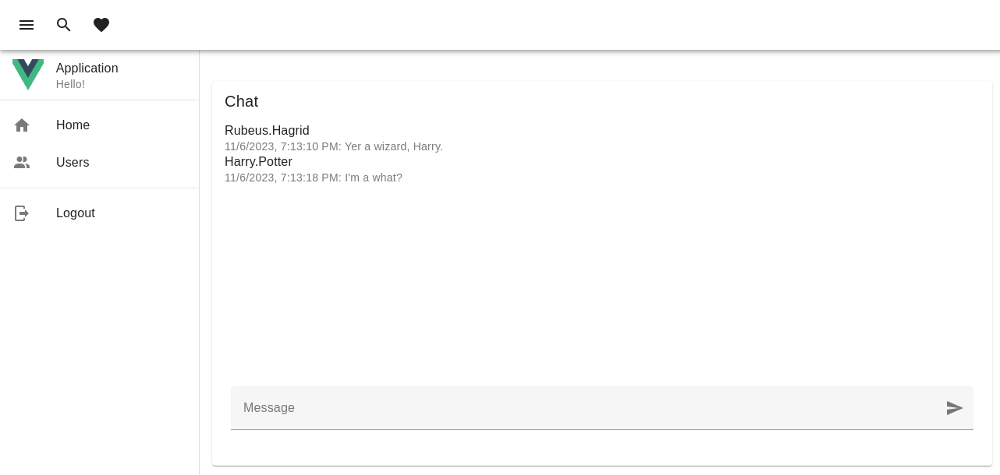

Additionally:

 - Application does look for bad guys

    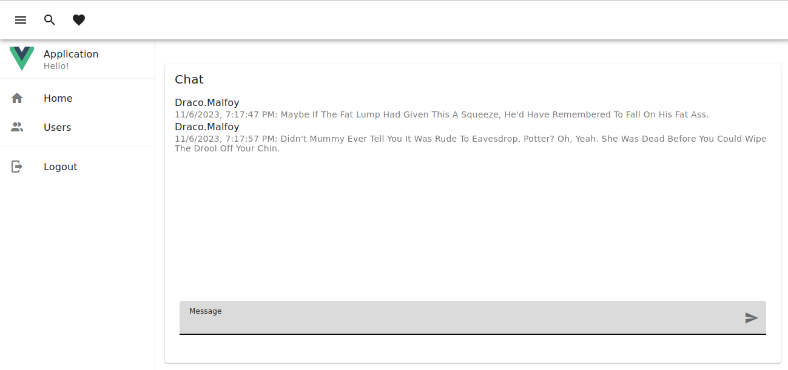

    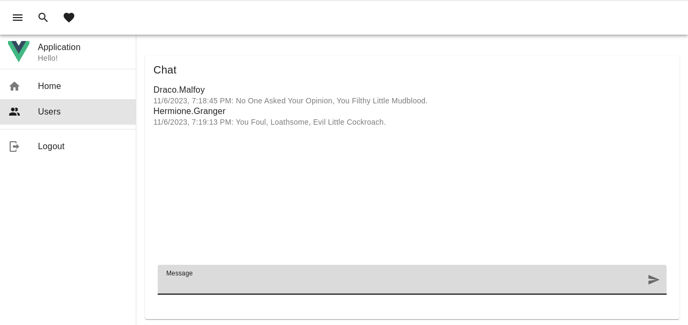

    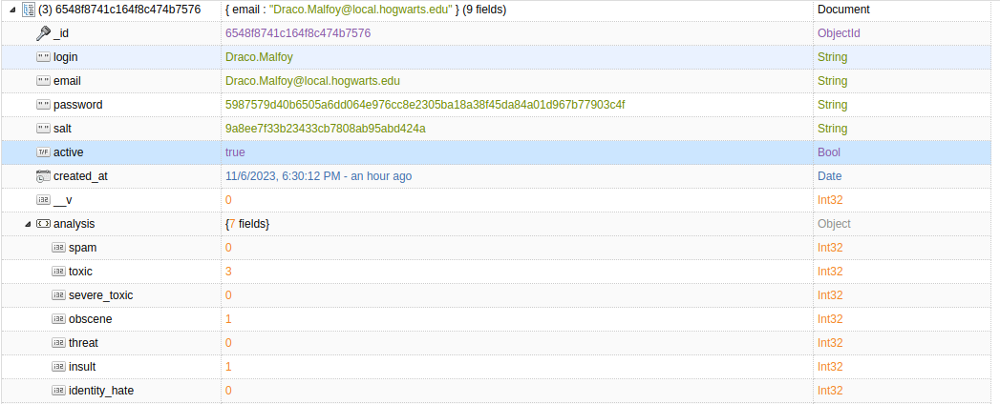

 - Application does look for spammers

    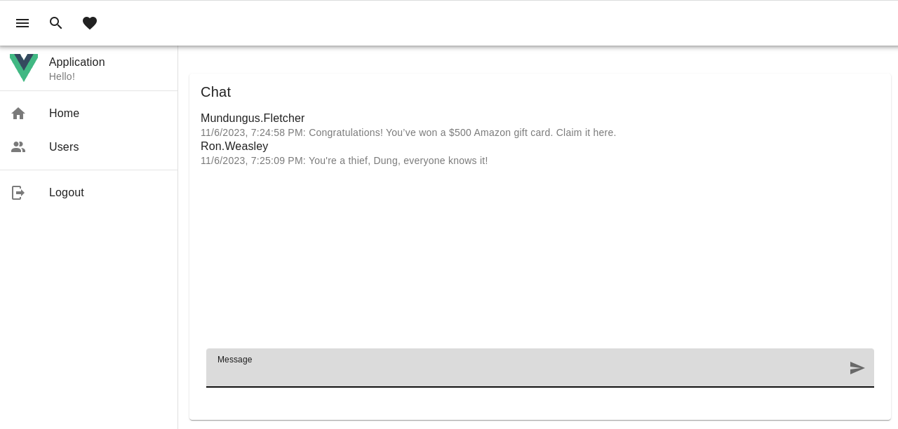

    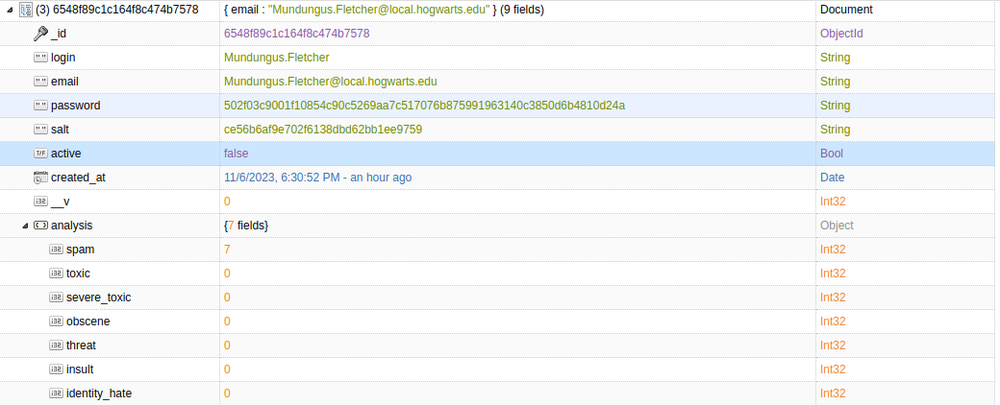

5) Not allow blocked users to login again

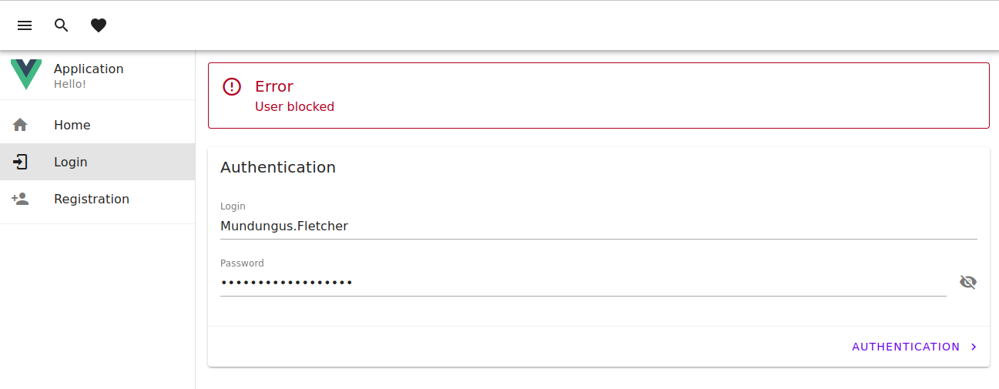

### Implementation

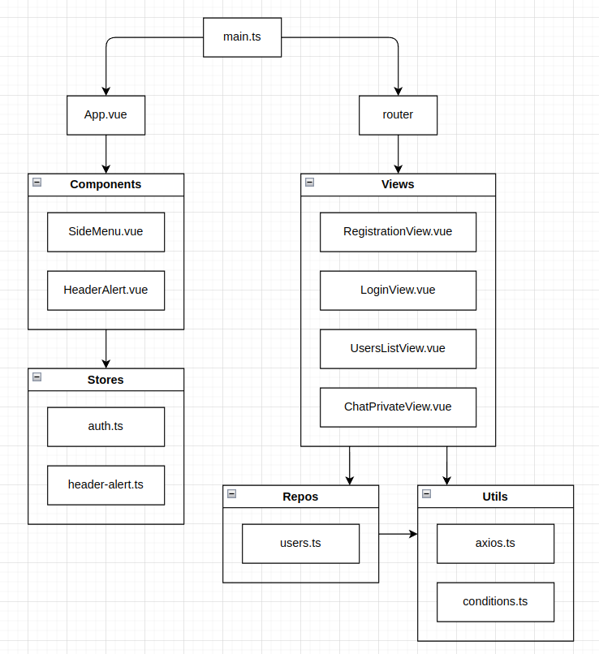

Here I will show how to create a little front-end application, with all described functionality. I use the `vue` framework and `vuetifyjs` as a ui library. I use `axios` for http requests, with JWT token for user access and `socket.io` for messaging. I use `pinia` to have storage and share data between different views and components.

First file - `main.ts` initiation of service.

```javascript
import { createApp } from "vue";
import { createPinia } from "pinia";

import App from "./App.vue";
import router from "./router";

import "@mdi/font/css/materialdesignicons.css";
import "vuetify/styles";
import { createVuetify } from "vuetify";
import * as components from "vuetify/components";
import * as directives from "vuetify/directives";

const vuetify = createVuetify({
  components,
  directives,
});

const app = createApp(App);
app.config.errorHandler = (error, vm, info) => {
  console.log("error", error, "info", info);
};
app.use(createPinia());
app.use(router);
app.use(vuetify);
app.mount("#app");

```

`App.vue` - this is the layout. Layout contains two components `SideMenu.vue` and `HeaderAlert.vue`.
```javascript
<script lang="ts">
import SideMenu from "./components/SideMenu.vue";
import HeaderAlert from "./components/HeaderAlert.vue";
import { useHeaderAlertStore } from "./stores/header-alert";

export default {
  data: () => ({
    toggle: true,
  }),
  methods: {
    toggleDrawer() {
      this.toggle = !this.toggle;
    },
  },
  components: { SideMenu, HeaderAlert },
  errorCaptured(error: any) {
    const headerAlertStore = useHeaderAlertStore();
    headerAlertStore.setError(error);
    if (error.response?.status === 401) {
      this.$router.push({ name: "login" });
    }
  },
};
</script>

<template>
  <v-app>
    <!-- header -->
    <v-app-bar>
      <v-app-bar-nav-icon
        variant="text"
        @click.stop="toggleDrawer"
      ></v-app-bar-nav-icon>

      <v-btn icon>
        <v-icon>mdi-magnify</v-icon>
      </v-btn>

      <v-btn icon>
        <v-icon>mdi-heart</v-icon>
      </v-btn>
    </v-app-bar>

    <!-- side menu -->
    <SideMenu v-model="toggle"></SideMenu>

    <!--  content -->
    <v-main>
      <v-container>
        <HeaderAlert></HeaderAlert>
        <RouterView />
      </v-container>
    </v-main>
  </v-app>
</template>
```

`HeaderAlert.vue` - shows notifications on the top of the page.
```javascript
<script lang="ts">
import { useHeaderAlertStore } from "../stores/header-alert";

export default {
  data: function () {
    const headerAlertStore = useHeaderAlertStore();
    return {
      headerAlertStore: headerAlertStore,
    };
  },
};
</script>

<template>
  <v-alert
    v-if="Boolean(headerAlertStore.success)"
    icon="mdi-alert-circle-outline"
    variant="outlined"
    color="success"
    title="Success"
  >
    {{ headerAlertStore.success?.message }}
  </v-alert>

  <v-alert
    v-if="Boolean(headerAlertStore.error)"
    icon="mdi-alert-circle-outline"
    variant="outlined"
    color="error"
    title="Error"
  >
    {{ headerAlertStore.error?.message }}
  </v-alert>

  <br />
</template>
```

`SideMenu.vue` - contains links from the left menu of the page, links should be different, depending on the user state - logged or not logged.
```javascript
<script lang="ts">
import { useAuthStore } from "../stores/auth";

export default {
  data: function () {
    const authStore = useAuthStore();
    return {
      title: "Application",
      authStore,
    };
  },

  methods: {
    logout: function () {
      this.authStore.logout();
      this.$router.push({ name: "login" });
    },
  },
};
</script>

<template>
  <v-navigation-drawer>
    <v-list>
      <v-list-item>
        <v-row no-gutters>
          <v-col cols="3">
            <v-avatar image="/src/assets/logo.svg" rounded="0"></v-avatar>
          </v-col>
          <v-col>
            <v-list-item-title>{{ title }} </v-list-item-title>
            <v-list-item-subtitle>Hello!</v-list-item-subtitle>
          </v-col>
        </v-row>
      </v-list-item>
    </v-list>

    <v-divider></v-divider>

    <v-list>
      <v-list-item title="Home" value="Home" prepend-icon="mdi-home" to="/">
      </v-list-item>

      <v-list-item
        v-if="!authStore?.auth"
        title="Login"
        value="Login"
        prepend-icon="mdi-login"
        to="/login"
      >
      </v-list-item>

      <v-list-item
        v-if="!authStore?.auth"
        title="Registration"
        value="Registration"
        prepend-icon="mdi-account-plus"
        to="/registration"
      >
      </v-list-item>

      <v-list-item
        v-if="authStore?.auth"
        title="Users"
        value="Users"
        prepend-icon="mdi-account-multiple"
        to="/users-list"
      >
      </v-list-item>
    </v-list>

    <v-divider></v-divider>

    <v-list v-if="authStore?.auth">
      <v-list-item
        title="Logout"
        value="Logout"
        prepend-icon="mdi-logout"
        @click="logout"
      >
      </v-list-item>
    </v-list>
  </v-navigation-drawer>
</template>
```

User login happens in the `LoginView.vue`, but I need to change links in the side menu for logged users. To have actual user's state I will use `stores/auth.ts`
```javascript
import { defineStore } from "pinia";

export const useAuthStore = defineStore("counter", {
  state: () => {
    const accessToken: string | null = localStorage.getItem("accessToken");
    const refreshToken: string | null =
      localStorage.getItem("refreshToken");
    return {
      accessToken,
      refreshToken,
      auth: Boolean(accessToken),
    };
  },
  actions: {
    refresh({ accessToken, refreshToken }: { accessToken: string, refreshToken: string }) {
      localStorage.setItem("accessToken", accessToken);
      localStorage.setItem("refreshToken", refreshToken);

      this.accessToken = accessToken;
      this.refreshToken = refreshToken;
    },

    login({ accessToken, refreshToken }: { accessToken: string, refreshToken: string }) {
      localStorage.setItem("accessToken", accessToken);
      localStorage.setItem("refreshToken", refreshToken);

      this.accessToken = accessToken;
      this.refreshToken = refreshToken;
      this.auth = true;
    },

    logout() {
      localStorage.removeItem("accessToken");
      localStorage.removeItem("refreshToken");

      this.accessToken = null;
      this.refreshToken = null;
      this.auth = false;
    },
  },
});
```

Errors may happen in any view after a user's actions or http request, but I always want to show these at the top of the page. To have data for alerts in the header I will use `stores/header-alert.ts`.
```javascript
import { defineStore } from "pinia";

export const useHeaderAlertStore = defineStore("headerAlert", {
  state: () => {
    return {
      error: undefined,
      success: undefined,
    };
  },
  actions: {
    clear(type: string, dt: number) {
      setTimeout(() => {
        if (this[type]?.dt === dt) {
          this[type] = undefined;
        }
      }, 10000);
    },
    setError(error: any) {
      this.success = undefined;

      const dt = Date.now();
      this.error = {
        ...error,
        dt,
        message: error.response?.data?.message || error.message,
      };
      this.clear("error", dt);
    },
    setSuccess(success: any) {
      this.error = undefined;

      const dt = Date.now();
      this.success = {
        dt,
        message: success.response?.data?.message || success.message,
        data: success.response?.data || success.data,
      };

      this.clear("success", dt);
    },
  },
});

```


Router - `router/index.ts` contains the list of routes and views for them.
```javascript
import { createRouter, createWebHistory } from "vue-router";

const router = createRouter({
  history: createWebHistory(import.meta.env.BASE_URL),
  routes: [
    {
      path: "/",
      name: "home",
      component: () => import("../views/HomeView.vue"),
    },
    {
      path: "/login",
      name: "login",
      component: () => import("../views/LoginView.vue"),
    },
    {
      path: "/registration",
      name: "registration",
      component: () => import("../views/RegistrationView.vue"),
    },
    {
      path: "/users-list",
      name: "users-list",
      component: () => import("../views/UsersListView.vue"),
    },
    {
      path: "/chat-private/:userId",
      name: "chat-private",
      component: () => import("../views/ChatPrivateView.vue"),
    },
  ],
});

export default router;
```

`RegistrationView.vue` - implements registration of users.
```javascript
<script lang="ts">
import { registerUser } from "@/repos/users";
import { isEmailValid } from "@/utils/conditions";
import { useHeaderAlertStore } from "@/stores/header-alert";

const headerAlertStore = useHeaderAlertStore();

export default {
  data: () => ({
    valid: false,

    showPwd: false,
    showRPwd: false,

    login: "",
    loginRules: [(value: string) => !!value || "Login is required"],

    email: "",
    emailRules: [
      (value: string) => !!value || "E-mail is required",
      (value: string) => {
        return isEmailValid(value) || "E-mail must be valid";
      },
    ],

    password: "",
    passwordRules: [(value: string) => !!value || "Password is required"],

    passwordRepeat: "",

    terms: false,
    termsRules: [(value: string) => !!value || "Accept of terms is required"],
  }),
  methods: {
    async sendRegistration(event: any) {
      event?.preventDefault();

      try {
        const { valid } = await this.validateField();
        if (!valid) {
          return;
        }
        const { login, email, password, passwordRepeat } = this;
        await registerUser({
          login,
          email,
          password,
          passwordRepeat,
        });

        headerAlertStore.setSuccess({
          message: "Registration completed! Let's try to login!",
        });
        setTimeout(() => {
          this.$router.push({ name: "login" });
        }, 1000);
      } catch (error) {
        headerAlertStore.setError(error);
      }
    },
    passwordRepeatRules(value: string) {
      return value === this.password || "Repeat password please!";
    },
    validateField() {
      return this.$refs.form.validate();
    },
  },
  watch: {
    login: "validateField",
    email: "validateField",
    password: "validateField",
    passwordRepeat: "validateField",
    terms: "validateField",
  },
};
</script>

<template>
  <v-form ref="form" v-model="valid" lazy-validation @submit="sendRegistration">
    <v-card class="mx-auto" title="User Registration">
      <v-container>
        <v-text-field
          v-model="login"
          :rules="loginRules"
          color="primary"
          label="Login"
          variant="underlined"
          required
        ></v-text-field>

        <v-text-field
          v-model="email"
          :rules="emailRules"
          color="primary"
          label="Email"
          variant="underlined"
          required
        ></v-text-field>

        <v-text-field
          v-model="password"
          :rules="passwordRules"
          :append-icon="showPwd ? 'mdi-eye' : 'mdi-eye-off'"
          :type="showPwd ? 'text' : 'password'"
          color="primary"
          label="Password"
          placeholder="Enter your password"
          variant="underlined"
          required
          @click:append="showPwd = !showPwd"
        ></v-text-field>

        <v-text-field
          v-model="passwordRepeat"
          :rules="[passwordRepeatRules]"
          :append-icon="showRPwd ? 'mdi-eye' : 'mdi-eye-off'"
          :type="showRPwd ? 'text' : 'password'"
          color="primary"
          label="Repeat password"
          placeholder="Repeat your password"
          variant="underlined"
          required
          @click:append="showRPwd = !showRPwd"
        ></v-text-field>

        <v-checkbox
          v-model="terms"
          :rules="termsRules"
          color="secondary"
          label="I agree to site terms and conditions"
        ></v-checkbox>
      </v-container>

      <v-divider></v-divider>

      <v-card-actions>
        <v-spacer></v-spacer>

        <v-btn color="primary" type="submit">
          Complete Registration

          <v-icon icon="mdi-chevron-right" end></v-icon>
        </v-btn>
      </v-card-actions>
    </v-card>
  </v-form>
</template>
```

`LoginView.vue` - implements login of users.
```javascript
<script lang="ts">
import { loginUser } from "@/repos/users";
import { useHeaderAlertStore } from "@/stores/header-alert";

const headerAlertStore = useHeaderAlertStore();

export default {
  data: () => ({
    valid: false,

    showPwd: false,

    login: "",
    loginRules: [(value: string) => !!value || "Login is required"],

    password: "",
    passwordRules: [(value: string) => !!value || "Password is required"],
  }),
  methods: {
    async sendLogin(event: any) {
      event.preventDefault();
      const { valid } = await this.validateField();
      if (!valid) {
        return;
      }
      try {
        const { login, password } = this;
        await loginUser({
          login,
          password,
        });

        headerAlertStore.setSuccess({
          message: "Login successful. Welcome!",
        });

        setTimeout(() => {
          this.$router.push({ name: "users-list" });
        }, 1000);
      } catch (error) {
        headerAlertStore.setError(error);
      }
    },
    validateField() {
      return this.$refs.form.validate();
    },
  },
  watch: {
    login: "validateField",
    password: "validateField",
  },
};
</script>

<template>
  <v-form ref="form" v-model="valid" lazy-validation @submit="sendLogin">
    <v-card class="mx-auto" title="Authentication">
      <v-container>
        <v-text-field
          v-model="login"
          :rules="loginRules"
          color="primary"
          label="Login"
          variant="underlined"
          required
        ></v-text-field>

        <v-text-field
          v-model="password"
          :rules="passwordRules"
          :append-icon="showPwd ? 'mdi-eye' : 'mdi-eye-off'"
          :type="showPwd ? 'text' : 'password'"
          color="primary"
          label="Password"
          placeholder="Enter your password"
          variant="underlined"
          required
          @click:append="showPwd = !showPwd"
        ></v-text-field>
      </v-container>

      <v-divider></v-divider>

      <v-card-actions>
        <v-spacer></v-spacer>
        <v-btn color="primary" type="submit">
          Authentication
          <v-icon icon="mdi-chevron-right" end></v-icon>
        </v-btn>
      </v-card-actions>
    </v-card>
  </v-form>
</template>
```

`UsersListView.vue` - implements list of users. Here I make the a of users with pagination.
```javascript
<script lang="ts">
import { getUsersList } from "@/repos/users";
import { useHeaderAlertStore } from "@/stores/header-alert";

const headerAlertStore = useHeaderAlertStore();

export default {
  data: () => ({
    users: [],
    count: 0,
    skip: 0,
    limit: 5,
    page: 1,
    pagesLength: 1,
    error: undefined,
  }),
  methods: {
    async getUsers() {
      try {
        const { users, count } = await getUsersList({
          skip: this.skip,
          limit: this.limit,
        });
        this.users = users;
        this.count = count;
        this.pagesLength = Math.ceil(this.count / this.limit);
      } catch (error: any) {
        headerAlertStore.setError(error);
        if (error.response?.status === 401) {
          this.$router.push({ name: "login" });
        }
      }
    },
  },
  async mounted() {
    this.getUsers();
  },
  watch: {
    page: function (page) {
      this.skip = (page - 1) * this.limit;
      this.getUsers();
    },
  },
};
</script>

<template>
  <v-table hover=true>
    <thead>
      <tr>
        <th class="text-left">Login</th>
        <th class="text-left">Actions</th>
      </tr>
    </thead>
    <tbody>
      <tr v-for="user in users" :key="user.id">
        <td>{{ user.login }}</td>
        <td>
          <v-btn
            prepend-icon="mdi-chat-outline"
            variant="outlined"
            color="primary"
            size="small"
            :to="`chat-private/${user.id}`"
            >Message</v-btn
          >
        </td>
      </tr>
    </tbody>
  </v-table>

  <div class="text-center">
    <v-container>
      <v-row justify="center">
        <v-col cols="8">
          <v-container class="max-width">
            <v-pagination
              class="my-4"
              :length="pagesLength"
              v-model="page"
            ></v-pagination>
          </v-container>
        </v-col>
      </v-row>
    </v-container>
  </div>
</template>
```

`ChatPrivateView.vue` - implements messenger for users. I use `socket.io` for messaging and send the authorization token inside every message, because `socket.io` has difficulties with updating data in headers.
```javascript
<script lang="ts">
import { v4 as uuidv4 } from 'uuid';
import { useHeaderAlertStore } from "@/stores/header-alert";
import { io } from "socket.io-client";
import { useAuthStore } from "@/stores/auth";
import { refreshTokenRequest } from '@/utils/axios';
import type { messageDto } from '@/dto/messages';
import type { userDto } from '@/dto/users';

const headerAlertStore = useHeaderAlertStore();
const authStore = useAuthStore();
const apiGatewayUrl = import.meta.env.VITE_SOCKET_URI;

const messages: messageDto[] = [];
const usersById: { [key: string]: userDto } = {};

export default {
  data: () => ({
    socket: io(apiGatewayUrl),
    message: "",
    messages,
    loading: false,
    disabled: false,
    roomId: '',
    uuid: '',
    usersById,
  }),
  async mounted() {
    try {
      this.socket.on("exception", async (error: any) => {
        try {
          if (error.message === 'jwt expired') {
            await refreshTokenRequest();
            if (!this.roomId) {
              this.joinRoom();
            }
            this.sendMessage(undefined);
          } else {
            throw error;
          }
        } catch (err: any) {
          headerAlertStore.setError(err);
          if (err.response?.status === 401) {
            this.$router.push({ name: "login" });
          }
        }
      });

      this.socket.on("connect", () => {
        this.joinRoom();
      });

      this.socket.on("joinPrivateRoom", (data) => {
        this.roomId = data.room.id;
        this.usersById = data.users.reduce((acc: { [key: string]: userDto }, user: userDto) => {
          acc[user.id] = user;
          return acc;
        }, {});

        this.messages = data.messages.map(({ uuid, user_id, message, created_at }: messageDto) => ({
          uuid,
          user_id,
          message,
          created_at,
          login: this.usersById[user_id]?.login,
        }));
        this.scrollDown();
      });

      this.socket.on("message", (data) => {
        const { uuid, user_id, message, created_at, } = data;
        this.messages.push({
          uuid,
          user_id,
          message,
          created_at,
          login: this.usersById[user_id]?.login,
        });

        if (uuid === this.uuid) {
          this.loading = false;
          this.disabled = false;
          this.message = '';
        }

        this.scrollDown();
      });

      this.socket.on("disconnect", () => {
        console.log("Disconnected");
      });


    } catch (error) {
      headerAlertStore.setError(error);
    }
  },
  beforeUnmount() {
    this.socket?.disconnect()
  },
  methods: {
    sendMessage(event: any|undefined) {
      event?.preventDefault();

      if (this.message) {
        this.loading = true;
        this.disabled = true;
        this.uuid = uuidv4();
        this.socket?.emit("message", {
          token: authStore.accessToken,
          message: this.message,
          uuid: this.uuid,
          room_id: this.roomId,
        });
      }

    },
    joinRoom() {
      this.socket.emit("joinPrivateRoom", {
        token: authStore.accessToken,
        userId: this.$route.params.userId,
        type: 'private',
      });
    },
    scrollDown() {
      const el = this.$refs.messages_container;
      if (this.messages?.length > 5) {
        setTimeout(() => {
          el.scrollToIndex(this.messages.length - 1);
        }, 1000);
      }
    }
  },
};
</script>

<template>
  <v-card class="mx-auto" title="Chat">
    <v-card-text>
      <v-virtual-scroll
        :height="300"
        :items="messages"
        ref="messages_container"
      >
        <template v-slot:default="{ item }">
          <v-list-item-title>{{ item.login }}</v-list-item-title>
          <v-list-item-subtitle>{{ new Date(item.created_at).toLocaleString() }}: {{ item.message }}</v-list-item-subtitle>
        </template>
      </v-virtual-scroll>
    </v-card-text>

    <v-card-actions>
      <v-container>
        <v-row dense>
          <v-col cols="12">

            <v-form ref="form" @submit="sendMessage">
              <v-text-field
                ref="message_field"
                :loading="loading"
                :disabled="disabled"
                label="Message"
                append-inner-icon="mdi-send"
                v-model="message"
                @click:append-inner="sendMessage"
              >
              </v-text-field>
            </v-form>

          </v-col>
        </v-row>
      </v-container>
    </v-card-actions>

  </v-card>
</template>
```

I need to get data for my interface or write something in my application, and I use one file which provides access to data `repos/users.ts`.
```javascript
import axios from "axios";
import { authenticatedRequest } from '@/utils/axios';
import { useAuthStore } from "@/stores/auth";
import type { userListDto, usersListQueryDto } from "@/dto/users";

const authStore = useAuthStore();
const apiGatewayUrl = import.meta.env.VITE_API_GATEWAY_URI;


// registration of user
export const registerUser = async (param: any) => {
  const { data } = await axios.post(`${apiGatewayUrl}/auth/registration`, param);
  return data;
};

// login of user
export const loginUser = async (param: any) => {
  const { data } = await axios.post(`${apiGatewayUrl}/auth/login`, param);
  const { accessToken, refreshToken } = data;

  authStore.login({ accessToken, refreshToken });
  return { accessToken, refreshToken };
};

// get list of users
export const getUsersList = async (
  param: usersListQueryDto
): Promise<userListDto> => {
  const url = new URL('/users/find-all', apiGatewayUrl);
  Object.entries(param).forEach(([ key, value ]) => url.searchParams.append(key, value?.toString()));

  return authenticatedRequest("get", url.href);
};
```

Different repositories may make different http requests with different data, but common part with implementation of http request with JWT token I put into infrastructure file `utils/axios.ts`
```javascript
import axios from "axios";
import { useAuthStore } from "@/stores/auth";

const authStore = useAuthStore();
const apiGatewayUrl = import.meta.env.VITE_API_GATEWAY_URI;

// request with Bearer token
const requestWithToken = async (method: string, url: string, param: any) => {
  const config = {
    headers: {
      Authorization: `Bearer ${authStore.accessToken}`,
    },
  };

  const result =
    method === "post"
      ? await axios.post(url, param, config)
      : await axios.get(url, config);
  return result.data;
};

// request for refresh Bearer token
export const refreshTokenRequest = async () => {
  const refreshTokenOld = localStorage.getItem("refreshToken");
  const config = {
    headers: {
      Authorization: `Bearer ${refreshTokenOld}`,
    },
  };

  const result = await axios.post(`${apiGatewayUrl}/auth/refresh`, {}, config);

  const { accessToken, refreshToken } = result.data;
  authStore.refresh({ accessToken, refreshToken });

  return { accessToken, refreshToken };
};

// request with token and refresh old
export const authenticatedRequest = async (
  method: string,
  url: string,
  param?: any
) => {
  try {
    return await requestWithToken(method, url, param);
  } catch (error: any) {
    if (error.response?.status === 401) {
      try {
        await refreshTokenRequest();

        return await requestWithToken(method, url, param);
      } catch (secondError) {
        authStore.logout();
        throw secondError;
      }
    }

    throw error;
  }
};
```